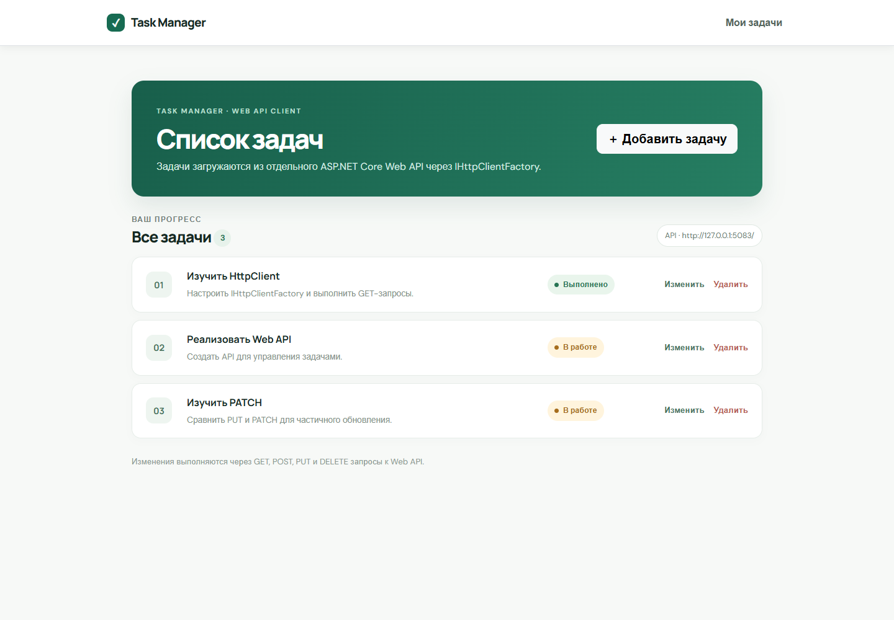
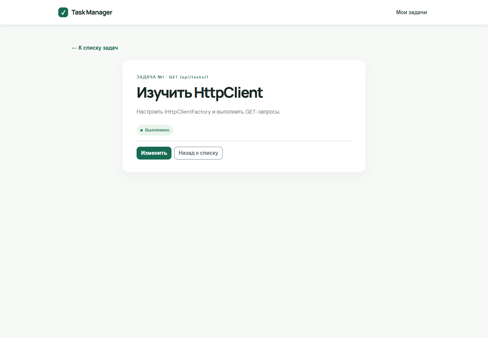
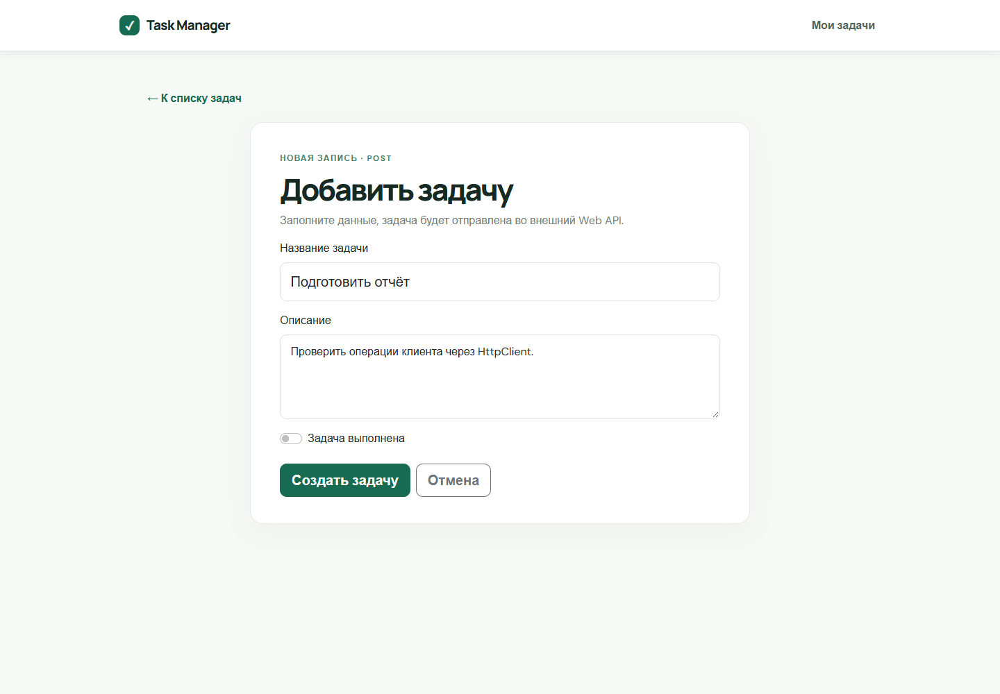
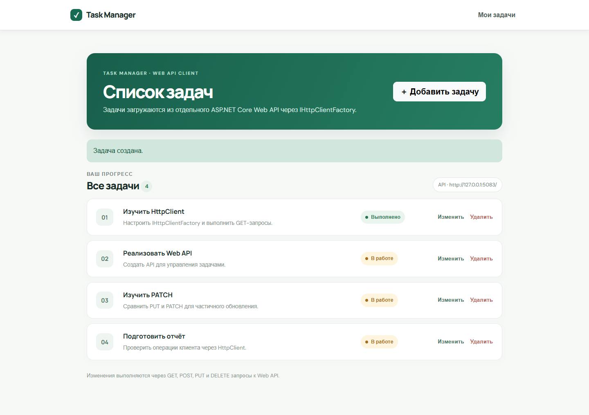
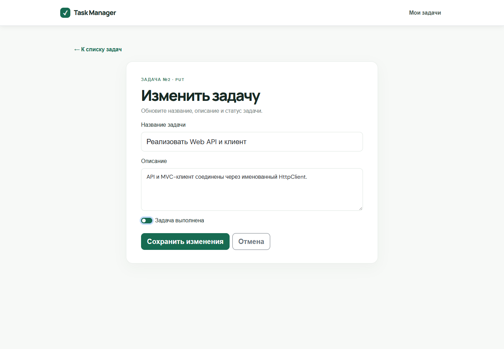
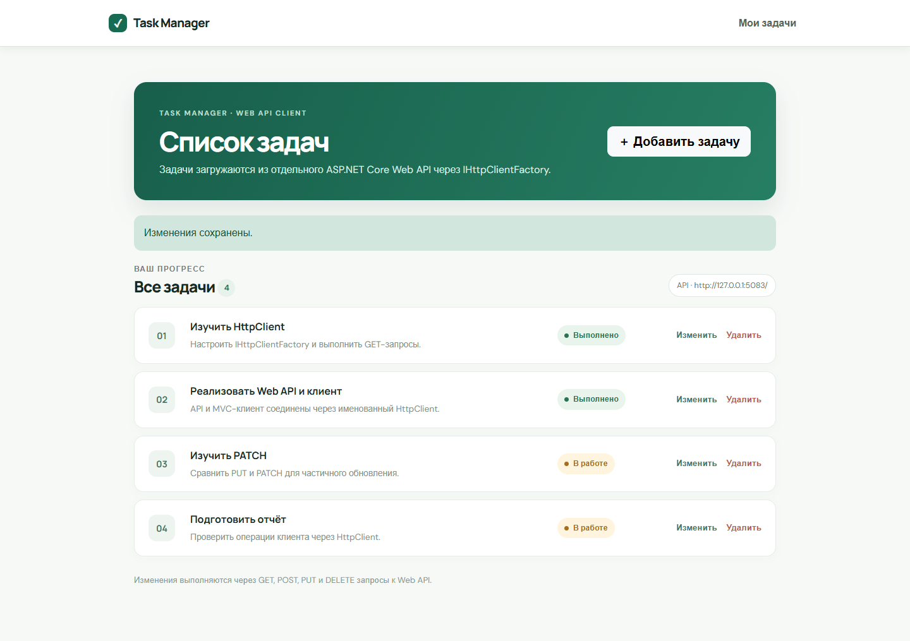
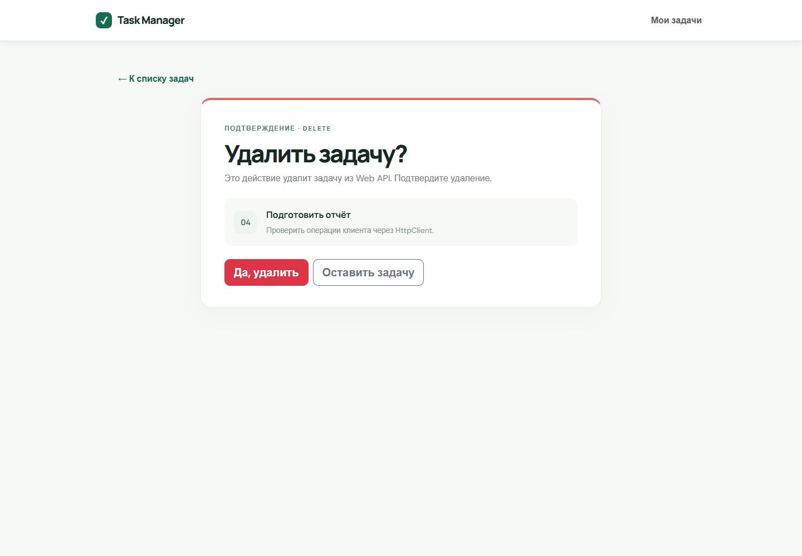
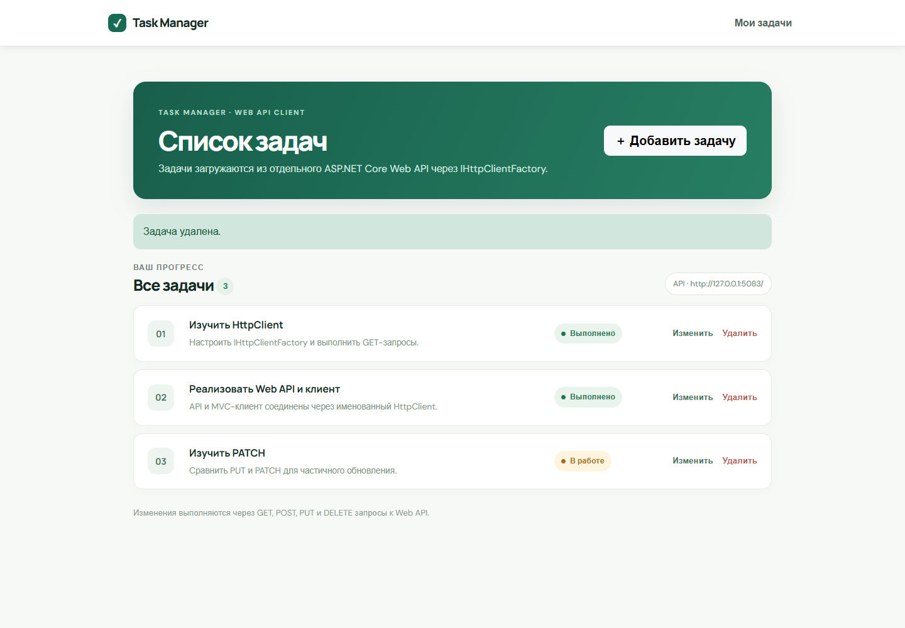
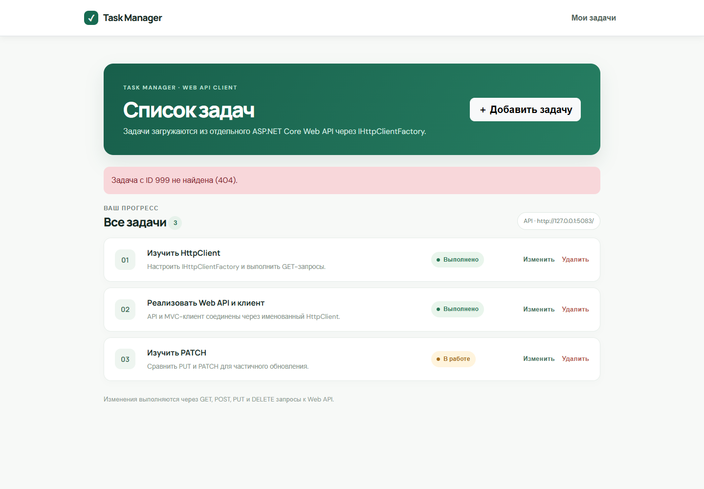

# Домашняя работа — Модуль 05: Task Manager Client

**CSE5032 · Разработка веб-сервисов · Модуль 05**

Здесь требовалось сделать клиентское MVC-приложение, которое управляет задачами через отдельный Web API. Поэтому запускаются два приложения: сервер API и клиент. Клиент получает именованный `HttpClient` через `IHttpClientFactory`, а сервис отправляет GET, POST, PUT и DELETE. Покажу список, просмотр, создание, редактирование и удаление с подтверждением. Ошибки API отображаются пользователю как понятное сообщение, а не завершают приложение.

---

## Цель работы

Разработать клиентское ASP.NET Core-приложение, которое обращается к Web API через `HttpClient` и выполняет CRUD-операции над задачами.

## Краткий отчёт о выполнении

`TaskManagerClient` — клиентское ASP.NET Core MVC-приложение для управления задачами. Оно отправляет HTTP-запросы во внешний для клиента Web API `TaskManagerApi`. Оба проекта созданы из стандартных шаблонов ASP.NET Core и находятся в одном решении для локального запуска.

Задача содержит `Id`, `Title`, `Description` и `IsCompleted`. Данные демонстрационного API хранятся в памяти и сбрасываются при перезапуске API.

## Ход выполнения

| Шаг | Выполненная работа | Результат |
|---|---|---|
| 1. Шаблоны | Созданы проекты `TaskManagerClient` (ASP.NET Core MVC) и `TaskManagerApi` (ASP.NET Core Web API), добавлены в `WebApiHome5.sln` | Клиент и API запускаются отдельно |
| 2. Модель | В проектах создана модель `TaskItem` с `Id`, `Title`, `Description`, `IsCompleted` | Список содержит три начальные задачи из условия |
| 3. Клиент API | Зарегистрирован именованный `HttpClient` с `BaseAddress`; `TaskApiClient` получает фабрику через DI | Запросы выполняются через `IHttpClientFactory` |
| 4. Получение данных | Реализованы получение списка и отдельной задачи | Веб-страница отображает полученные данные; для неизвестного Id показывает сообщение 404 |
| 5. Изменение данных | Добавлены форма POST, редактирование через PUT и страница подтверждения DELETE | Новые задачи создаются, изменения сохраняются, удаление выполняется только после подтверждения |
| 6. Обработка ответов | Обрабатываются успешные ответы, 400, 404, 500 и ошибки соединения | Ошибки показываются пользователю понятным текстом |
| 7. Проверка | В браузере выполнены просмотр списка и задачи, создание, изменение статуса и удаление | Снимки реальных операций приложены ниже |

## HTTP-методы

| Действие | Метод API | Endpoint | Успешный ответ |
|---|---|---|---|
| Показать список | GET | `/api/tasks` | `200 OK` |
| Открыть задачу | GET | `/api/tasks/{id}` | `200 OK` |
| Добавить задачу | POST | `/api/tasks` | `201 Created` |
| Изменить задачу и статус | PUT | `/api/tasks/{id}` | `200 OK` |
| Удалить после подтверждения | DELETE | `/api/tasks/{id}` | `204 No Content` |

Клиент учитывает ошибки `400 Bad Request`, `404 Not Found` и `500 Internal Server Error`, а также проблемы соединения: показывает пользователю понятное сообщение и продолжает работать.

## IHttpClientFactory

В `Program.cs` зарегистрирован именованный клиент `TaskApi` через `AddHttpClient`. Его `BaseAddress` берётся из конфигурации. `TaskApiClient` получает `IHttpClientFactory` через DI и создаёт настроенный клиент методом `CreateClient("TaskApi")`. Таким образом, приложение повторно использует управляемую фабрикой конфигурацию и не создаёт новый `HttpClient` вручную перед запросами.

## Скриншоты выполнения

Все снимки сделаны в браузере во время выполнения реальных действий с клиентом и API.

### Список задач — GET `/api/tasks`

### Просмотр задачи — GET `/api/tasks/1`

### Добавление задачи — форма и POST

### Изменение задачи — форма и PUT

### Удаление задачи — подтверждение и DELETE

### Обработка 404

## Вывод

Создано рабочее MVC-приложение, которое получает и изменяет задачи через отдельный Web API. `IHttpClientFactory` предоставляет именованный HTTP-клиент с заданным базовым адресом, а пользовательские формы позволяют выполнить полный CRUD-цикл.
